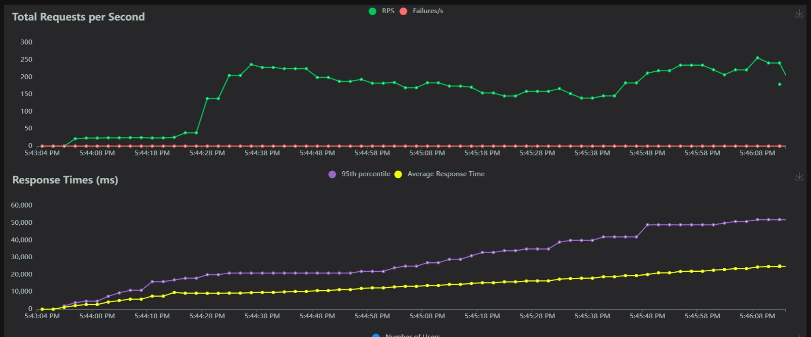

# Web-scale Data Management Project 
 
## Solution using 2 Phase Commit + 2 Phase Locking : 
consistent, fault tolerant but not scalable

## Implementation 
- For our application, we implement a 2 Phase Commit Protocol along with 2 Phase Locking. 
- The order service acts as the coordinator.
- On receiving a checkout request, the order service databse is locked.
- **Prepare Phase** : 
    - Order service calls the stock service to check if it has enough stock and the paymment service to check if the user has enough credits to process the order
    - If the stock service does not have sufficient stock or if the user does not have sufficient credits (400 status), the transaction is cancelled and the locks are released.
    - If both services return a 200 status(success), the commit phase is commenced. 
- **Commit Phase** : 
    - In the commit phase, order service sends a call to stock and payment services to commit the changes to the database.
    - Once both the services completes the commit operations, the order service db commits the changes and releases the lock.

### Fault Tolerance
To ensure that our system is robust, we implemented recovery logging. The logs and values are written to the database. For each transaction, we generate a unique id. Each time we write to the database, the logs corresponding the transaction id are written to the database as well to keep track of the changes made so far. This ensures exactly once processing. 

**Order Service Failure** : If the order service fails, we store logs in the stock and payment service db corresponding to the given order. Once the order services revives, if the client sends the same checkout http requst again, then it will continue with the payment and stock operations using their respective logs. However, if the same request is not resent then the service will continue on and there may be inconsistencies between stock and payment service. 

**Stock Service Failure** : If stock service fails, the order service waits for the stock service to recover and checks the stock service logs to track the changes written to the disk so far. For each item in the stock, we check if there are any write operations done for the item and order combination in the stock service database. If there are, we return a 200 status back to stock. If not, we perform the operations in the stock service and return the response.

**Payment Service Failure** : If the payment service fails, the order service waits for the payment service to recover and checks the payment service logs to track the changes written to the disk so far. If there are any write operations done corresponding to the order in the payment service database, we return a 200 status back to stock. If not, we perform the operations in the payment service and return the response.

For fault tolerance, we made the following assumptions: 
- Once a service is down, it would be revived after a while.  
- On failing a service, any API calls made to the service would return a "502 Gateway Not Found" response.

## What works :
- Atomic transactions for each checkout
- Prevents dirty reads
- Consistent and perfoms well in the consistency test. 

## Limitations of our method: 
- Not Scalable
- Failure of the coordinator (order service) could impact the protocol and cause inconsistencies if the request is not resent. 

## Locust result

# Other architectures that we tried to implement
Before resorting to 2PC we tried three other implementations, specifically focusing on orchestrated SAGAS. We first attempted an asynchronous version of SAGAS using kafka. Then we switched to a synchronous SAGAS implementation using rabbitmq, where we tried to implement with threading and then with a separate consumer service. 

Our three significant attempts are outlined as follows: 

## **Asynchronous orchestrated SAGAS with AIOKafka and Quart - {branch: set-up kafka}**
### What we implemented
- Used AIOKafka as the message bus between the services
- To make it asychronous, we used Quart and aiokafka
- The order service was again the orchetrator
- We created our own test endpoint called find_item that when called would publish a message from order to stock. After consuming the message, stock would find the requested item and publish a message back to the order service. We specified the required topics to ensure that the corressponding services would listen for the correct messages.
### Issues faced
- While the communcation using aiokfka worked for our test endpoint, when incorporating HTTP requests our implementation failed.
- The quart app of the stock had a continuous consumer and when we needed to consume additional external HTTP requests sent to stock like add_item the service was blocked.

## **Synchronous orchestrated SAGAS with rabbitmq - with threading - {branch: rmq_order_payment}**
### What we implemented
- Used RabbitMQ as the message bus between the services
- Used the order service as the orchestrator 
- For each service we utilised threading to have the consumers and publishers act independently within the same service so that they do not block each other. 
- Process:
    - Order service would publish a request onto the stock-queue or the payment-queue which is consumed by the stock or payment service respectively. 
    - The stock/payment services processes the request and publishes the response onto a stock_response_queue or payment_response_queue back to the order-service where it would constantly consume messages and then enqueue them into a global response_queue. 
    - The order service would then pop the queue where needed and obtain the requests from the response_queue and use it for further processing. 

### Issues faced
- The main issue was with the threading, the time that python takes to switch between threads caused our transactions to time out and we could not manually change between the threads to workout around the delay. 

## **Synchronous orchestrated SAGAS with rabbitmq - separate consumer service - {branch: order_consumer}**
### What we implemented
- Used RabbitMQ as the message bus between the services
- Set up a separate consumer (as a service) for the order service
- Process:
    - Order service would publish a request onto the stock-queue or the payment-queue which is consumed by the stock or payment service respectively. 
    - The stock/payment services processes the request and publishes the response to the order-consumer service where it would constantly consume messages and enqueue them into a separate response_queue for the payment and stock responses. 
    - The order service would then send an HTTP request to order-consumer service and dequeue the requests from the response_queue and use it for further processing. 
### Issues faced
- The order-consumer would sometimes get the http request from the order service before it would have even consumed the responses from the stock and payment services. We decided to loop the HTTP requests from the order service until it is able to dequeue a proper response. This would effectively block the order-service from taking in new requests, resulting in a timeout during the consistency test. Our implementation is therefore slow and not scalable.

# Testing Instructions

## docker-compose (local development)

- run `docker-compose up --build` in the base folder of to test

***Requirements:*** You need to have docker and docker-compose installed on your machine.
